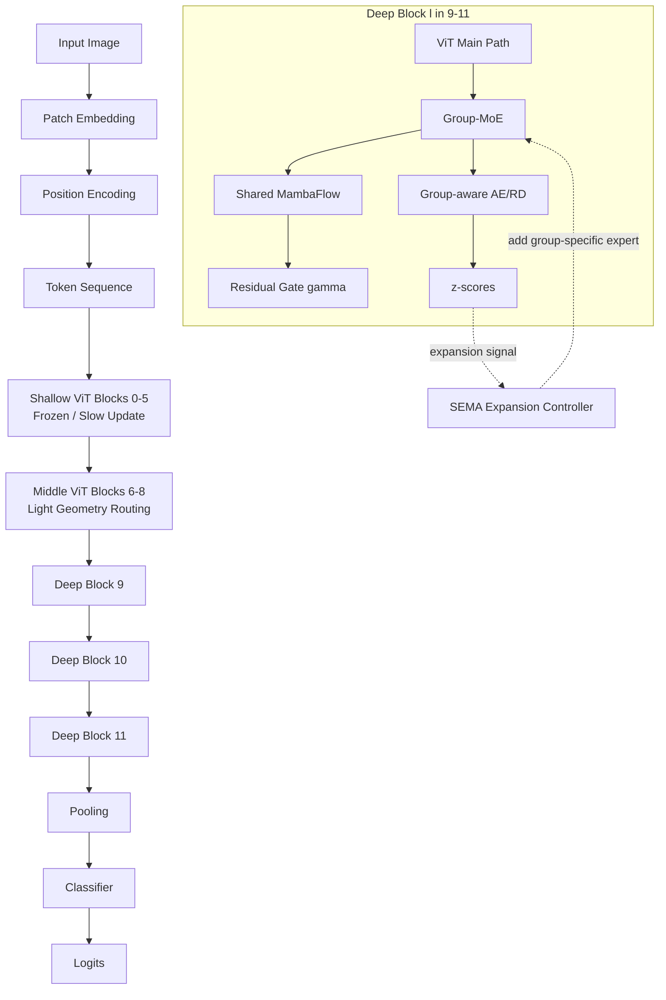
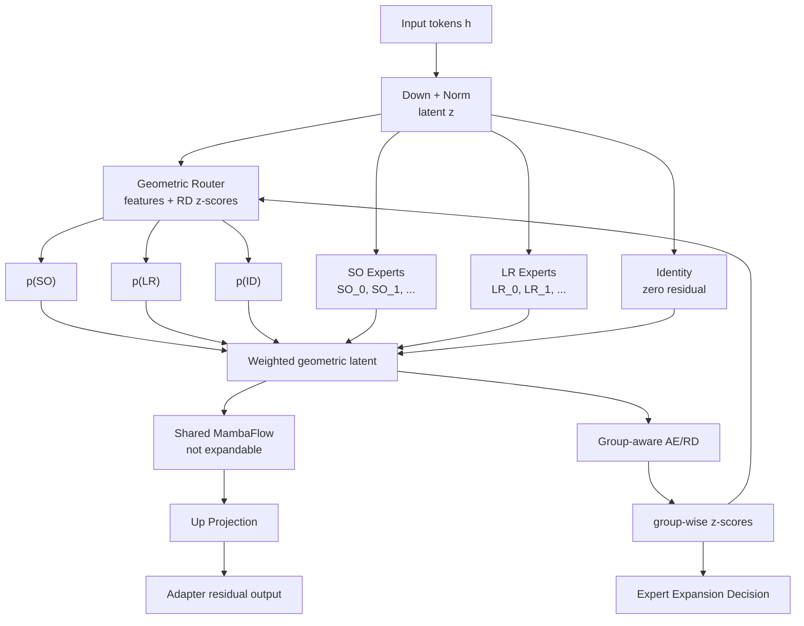

# Geometry-Aware SEMA with Group-MoE and Shared Mamba Flow

## 1. Final Idea

This design extends SEMA for continual learning by replacing the original functional adapter with a geometry-aware Group-MoE module. The framework keeps a stable pretrained ViT representation, introduces a fixed bank of Lie/group-inspired experts, uses Mamba as a shared geometry-conditioned semantic flow operator, and uses Group-aware AE/RD modules to detect whether new tasks can be explained by existing geometric knowledge.

Core principle:

```text
Stable pretrained backbone + fixed group bank + expandable group-specific experts + shared Mamba flow
```

Mamba is not expanded. It is treated as a stable flow / connection operator. Expansion happens inside each group, by adding group-specific local experts or sections.

## 2. Conceptual Interpretation

From a principal-bundle / associated-bundle perspective:

```text
Stable backbone:
  shared semantic base space

GroupBank:
  fixed structural group candidates

Group-specific experts:
  local sections / fiber experts

Mamba:
  shared semantic transport / flow operator

Group-aware AE/RD:
  knowledge statistician that checks whether current features fit existing group-conditioned knowledge
```

The model should learn new tasks by adding or selecting local fiber experts, not by changing the global semantic coordinate system.

## 3. Backbone Layout

Recommended architecture:

```text
Input Image
  -> Patch Embedding
  -> Position Encoding
  -> Shallow ViT Blocks 0-5
  -> Middle ViT Blocks 6-8
  -> Deep Blocks 9-11 with Group-MoE + Shared Mamba Flow + Group-aware RD
  -> Pooling
  -> Classifier
```

Layer roles:

```text
Layer 0-5:
  frozen or slow-updated ViT
  shared low-level visual and geometric base
  no expansion

Layer 6-8:
  middle semantic alignment
  optional light geometry routing
  high expansion threshold

Layer 9-11:
  main continual-learning adaptation layers
  Group-MoE active
  Group-aware AE/RD active
  expansion allowed only for group-specific experts
```

## 4. Fixed GroupBank

Initialize all candidate group types at model construction time.

Recommended first version:

```text
GroupBank = {
  Identity,
  SO,
  LR,
  Affine,
  MambaFlow
}
```

Important distinction:

```text
Group type expansion:
  not used in first version

Group-specific expert expansion:
  used for continual learning
```

For example:

```text
SO group:
  SO_0, SO_1, SO_2, ...

LR group:
  LR_0, LR_1, ...

Affine group:
  Affine_0, Affine_1, ...

Identity:
  stable zero-residual path

MambaFlow:
  shared and not expanded
```

## 5. Group-MoE Adapter

The original SEMA adapter:

```text
Adapter(h)
```

is replaced with:

```text
GroupMoEAdapter(h)
```

The deep-layer output is:

```text
u_l = ViTBlock_l(h_l)

a_l = GroupMoEAdapter_l(u_l)

h_{l+1} = u_l + gamma_l * a_l
```

`gamma_l` is a learnable residual gate, initialized to zero or a very small value.

### 5.1 Expert Types

Identity expert:

```text
T_ID(z) = 0
```

Use zero residual, not `z`, because the main path already carries `u_l`.

SO expert:

```text
z = Down(LN(h))
z_SO = z R
R in SO(r)
```

Use low-dimensional bottleneck space:

```text
768 -> r -> 768
```

Recommended:

```text
r = 16 or 32
```

LR expert:

```text
z_LR = z + z A B
```

where:

```text
A in R^{r x k}
B in R^{k x r}
k << r
```

Affine expert:

```text
z_Affine = z W + b
```

Use carefully, because it is more flexible and less constrained.

MambaFlow:

```text
u = MambaFlow(z_G)
```

Mamba is not treated as an expandable expert. It is a shared geometry-conditioned flow operator.

## 6. Shared Geometry-Conditioned Mamba Flow

Mamba is used to model semantic flow after geometric conditioning.

Recommended formula:

```text
z_l = W_down LN(h_l)

pi_l = GroupRouter(z_l, RD_stats)

z_l^G = sum_g pi_{l,g} * T_g(z_l)

m_l = SharedMambaFlow(z_l^G)

a_l = W_up m_l

h_{l+1} = h_l + gamma_l * a_l
```

Interpretation:

```text
Group-MoE chooses a geometric coordinate / local section.
MambaFlow models semantic token transport inside that geometry-conditioned space.
```

Mamba's goal:

```text
Learn geometry-conditioned semantic state evolution over visual tokens.
```

It should not:

```text
replace the whole ViT backbone
store task-specific knowledge by expansion
freely rewrite the semantic space
```

## 7. Router Design

Use a hierarchical geometric router.

```text
GroupRouter:
  chooses group type

ExpertRouter:
  chooses expert inside the selected group
```

Final expert weight:

```text
w_{g,e} = p(g | h) * p(e | g, h)
```

Recommended router input:

```text
router_input = concat(
  cls_token,
  mean(tokens),
  std(tokens),
  group_wise_RD_z_scores,
  optional_group_usage
)
```

Group score:

```text
score_g = MLP(h)_g - beta * stopgrad(z_g)

p(g | h) = softmax(score_g / tau)
```

This makes routing depend on both feature evidence and whether the corresponding group can explain the current sample.

Sparse routing is recommended:

```text
training:
  soft or top-2 routing

inference:
  top-1 or top-2 routing
```

## 8. Group-Aware AE/RD

Original SEMA uses a normal AE as representation descriptor:

```text
L_RD = MSE(AE(h), h)
```

This design uses Group-aware AE/RD:

```text
L_group_RD = sum_g p(g | h) * MSE(AE_g(z_G), z)
```

Each group maintains separate statistics:

```text
Records_g:
  mean_g
  std_g
  z_score_g
  usage_g
```

The RD module answers:

```text
Can the current sample be explained by existing group-conditioned knowledge?
```

Expansion is triggered only when existing group experts cannot explain the sample.

## 9. Expansion Policy

The default expansion is group-specific expert expansion.

Do not expand Mamba in the first version.

Do not expand group types in the first version.

Expansion target:

```text
SO_k -> SO_{k+1}
LR_k -> LR_{k+1}
Affine_k -> Affine_{k+1}
```

Expansion trigger:

```text
For a group g:
  p(g | h) is high
  z_g is high
  all experts inside group g have high z-score
  condition persists for multiple batches

Then:
  add Expert_{g,new}
```

Fallback:

```text
If all group types have high z-score,
do not immediately add a new group type.
First add experts inside the most plausible existing group.
```

Group type expansion should be treated as a rare future extension.

## 10. Deep Layer Output

For layers 9-11, each layer should return a structured output:

```text
LayerOutput = {
  h_out,
  adapter_out,
  group_probs,
  expert_probs,
  rd_loss,
  z_scores,
  added
}
```

Backbone uses:

```text
h_out
```

Continual-learning controller uses:

```text
rd_loss
z_scores
group_probs
expert_probs
added
```

Total RD loss:

```text
L_RD = L_RD^9 + L_RD^10 + L_RD^11
```

Expansion record:

```text
added_record = [added_9, added_10, added_11]
```

## 11. Three Main Losses

Compress all objectives into three main losses:

```text
L_total = L_cls + lambda_1 * L_geo_rd + lambda_2 * L_sem
```

### 11.1 Classification Loss

```text
L_cls = CE(logits, y)
```

It learns the current task.

### 11.2 Geometry-RD Loss

```text
L_geo_rd =
    alpha_rd(s)   * L_group_RD
  + alpha_geo(s) * L_geo
  + alpha_bal(s) * L_balance
```

Group-aware RD:

```text
L_group_RD = sum_g p(g | h) * MSE(AE_g(z_G), z)
```

SO constraint:

```text
L_geo = ||R^T R - I||^2
```

Router balance:

```text
L_balance = KL(mean_batch(p(g | h)) || prior_g)
```

### 11.3 Semantic Preservation Loss

```text
L_sem =
    L_proto
  + beta_router * L_router
  + optional_beta_flow * L_flow
```

Prototype consistency:

```text
L_proto = sum_k ||c_k^t - c_k^{t-1}||^2
```

Router consistency:

```text
L_router = KL(p_old(g | h) || p_new(g | h))
```

Optional flow consistency:

```text
L_flow = ||MambaFlow_t(proto_seq_old) - MambaFlow_{t-1}(proto_seq_old)||^2
```

If no old samples are stored, use:

```text
class prototypes
RD statistics
synthetic prototype tokens
```

## 12. Adaptive Weights in L_geo_rd

The internal weights of `L_geo_rd` should adapt according to geometric state.

Geometric state:

```text
s_{l,g} = [
  rd_zscore_{l,g},
  router_entropy_{l,g},
  group_usage_{l,g},
  orth_error_{l,g},
  proto_drift_l,
  expert_age_{l,g}
]
```

Recommended rule-based version:

```text
alpha_rd = clip(1 + gamma_z * z_norm, alpha_rd_min, alpha_rd_max)

alpha_geo = clip(alpha0 * (1 + gamma_o * orth_error), alpha_geo_min, alpha_geo_max)

alpha_bal = clip(alpha0 * (1 + gamma_u * usage_imbalance), alpha_bal_min, alpha_bal_max)
```

Use detached states:

```text
alpha = f(stopgrad(s))
```

Reason:

```text
prevent the model from gaming the adaptive weights
```

## 13. Training Flow

### Task 0

```text
1. Build pretrained ViT backbone.
2. Initialize fixed GroupBank.
3. Initialize one expert per expandable group.
4. Initialize shared MambaFlow.
5. Train classification path:
     Group-MoE experts
     router
     classifier
6. Train Group-aware AE/RD.
7. Freeze old experts and RD statistics at task end.
```

### Task t > 0

```text
1. Enable detecting_outlier in deep layers.
2. For each detection batch:
     compute group probabilities
     compute group-wise RD z-scores
     decide whether existing experts can explain the sample
3. If no expansion:
     train current routing and allowed new-task parameters
4. If expansion:
     add a new expert inside the selected group
     train new expert + router + classifier
     train its Group-aware RD
5. End of task:
     freeze old experts
     freeze RD statistics
     merge temporary router columns
     update prototypes and semantic anchors
```

## 14. Recommended First Implementation

Keep the first version simple:

```text
Layers with adaptation:
  9, 10, 11 only

Groups:
  Identity
  SO
  LR
  MambaFlow

Expandable:
  SO experts
  LR experts

Not expandable:
  MambaFlow
  Identity
  group types

Router:
  group router + group-wise z-score correction

RD:
  group-aware AE on bottleneck latent z

Loss:
  L_cls + lambda_1 L_geo_rd + lambda_2 L_sem
```

## 15. Mermaid Architecture Diagram



## 16. Mermaid Group-MoE Diagram



## 17. Code Mapping to Original SEMA

Original SEMA locations:

```text
models/sema.py:
  training flow

backbone/sema_block.py:
  AdapterModule
  SEMAModules

backbone/sema_components.py:
  Adapter
  AE
  Records

backbone/vit_sema.py:
  ViT block with adapter insertion
```

Main replacement:

```text
Adapter -> GroupMoEAdapter

AE -> GroupAwareAE

SEMAModules -> GeometrySEMAModules
```

Preserve:

```text
detecting_outlier
added_record
end_of_task_training
new_router / router merge idea
RD statistics
task-wise freeze
```

Change:

```text
ordinary adapter expansion
  -> group-specific expert expansion

single RD loss
  -> group-aware RD loss

plain router
  -> geometric router corrected by RD z-score

Mamba expert expansion
  -> no Mamba expansion; use shared MambaFlow
```

## 18. Short Research Summary

This method treats continual learning as geometry-aware semantic structure preservation. A pretrained ViT provides a stable semantic base. A fixed GroupBank provides candidate geometric priors. Group-MoE selects and expands local group-specific experts to absorb new task variations. A shared MambaFlow models geometry-conditioned semantic transport over tokens without being expanded. Group-aware AE/RD modules decide whether current samples fit existing group-conditioned knowledge. The model learns new tasks through local fiber expert expansion while keeping the global semantic structure stable.